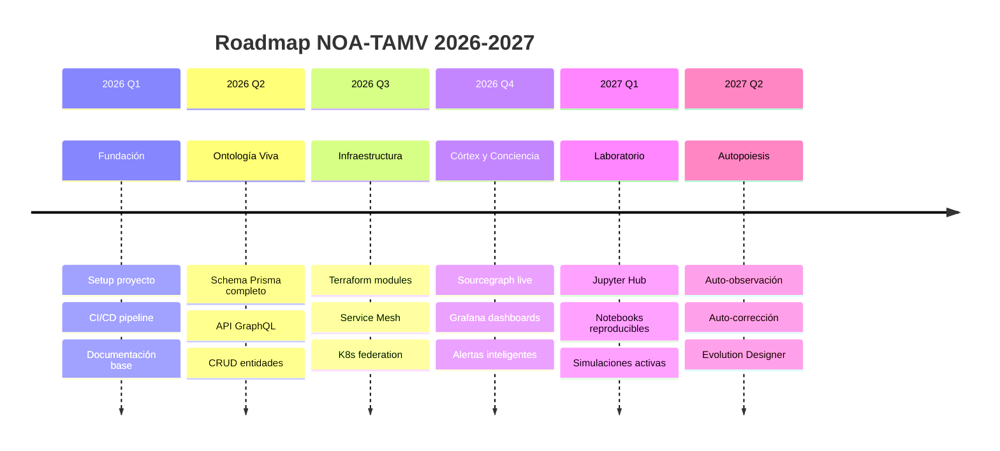
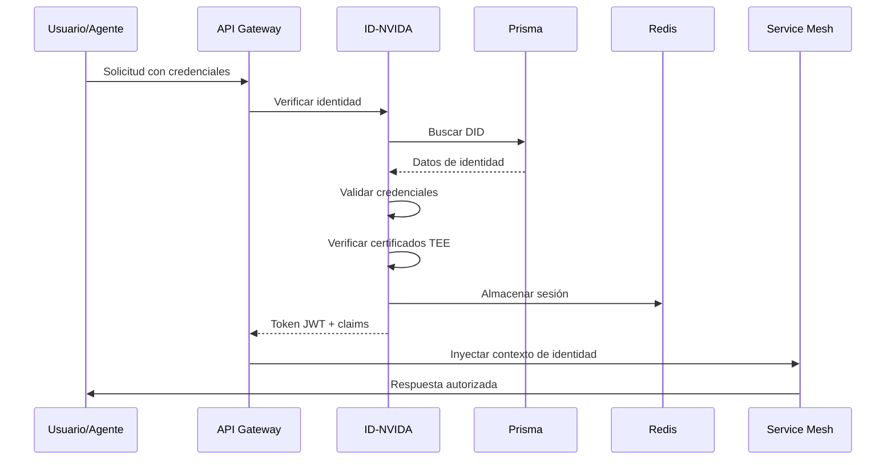
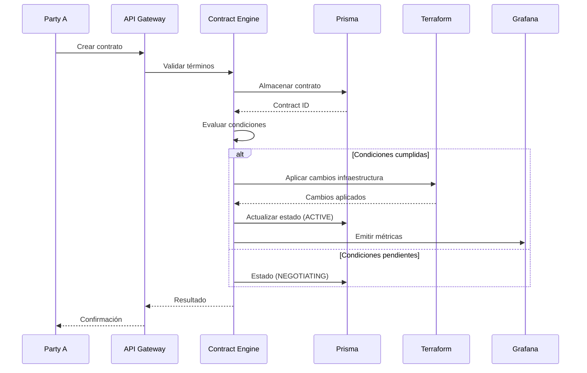
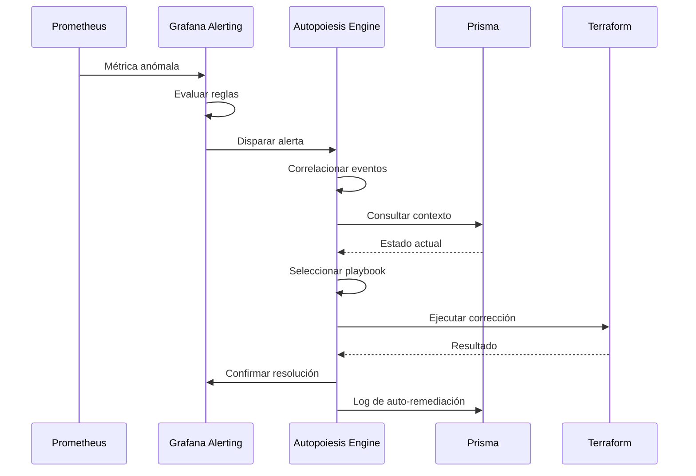

ed
        
  data_corruption_detected:
    detection: |
      checksum_mismatch or
      referential_integrity_violation
    
    steps:
      - action: quarantine_affected_data
        scope: affected_records_only
        
      - action: identify_last_known_good
        source: backup_snapshots
        
      - action: restore_or_reconcile
        decision_tree:
          if: corruption_recent and isolated
          then: restore_from_replica
          else: restore_from_backup + replay_logs
          
      - action: notify_data_stewards
        message: detailed_corruption_report

# -------------------------------------------------
# APRENDIZAJE DE INCIDENTES
# -------------------------------------------------

incident_learning:
  # Captura de contexto
  context_capture:
    - metrics_before_during_after
    - configuration_state
    - recent_deployments
    - user_actions
    
  # Análisis post-mortem
  analysis:
    - root_cause_classification
    - contributing_factors
    - detection_time_analysis
    - remediation_effectiveness
    
  # Actualización de conocimiento
  knowledge_update:
    - add_to_runbook
    - update_alert_rules
    - refine_anomaly_models
    - share_lessons_learned

---

## 11. ESTRUCTURA DE DIRECTORIOS AUTOPOIÉTICA

### 11.1 Organización del Proyecto

```
tamv-core/                          # Raíz del Núcleo Operativo
├── 📁 docs/                        # Documentación viva
│   ├── architecture/               # Documentos de arquitectura
│   │   ├── TAMV-Core-Architecture.md
│   │   ├── ADRs/                   # Architecture Decision Records
│   │   ├── diagrams/               # Diagramas generados
│   │   └── api/                    # Especificaciones de API
│   ├── ontology/                   # Documentación ontológica
│   │   ├── entities/               # Documentación de entidades Prisma
│   │   ├── relationships/          # Relaciones entre entidades
│   │   └── domain-maps/            # Mapas de dominios
│   ├── operations/                 # Runbooks y procedimientos
│   │   ├── runbooks/               # Playbooks de operación
│   │   ├── incidents/              # Registro de incidentes
│   │   └── postmortems/            # Análisis post-mortem
│   └── research/                   # Investigación y experimentos
│       ├── papers/                 # Papers y análisis
│       └── experiments/            # Resultados de experimentos
│
├── 📁 prisma/                      # Esquema ontológico ejecutable
│   ├── schema.prisma               # Definición principal
│   ├── enums/                      # Enumeraciones
│   ├── models/                     # Modelos por dominio
│   │   ├── identity.prisma
│   │   ├── civilization.prisma
│   │   ├── governance.prisma
│   │   └── artifacts.prisma
│   ├── migrations/                 # Historial de evolución
│   │   └── migration_lock.toml
│   └── seed/                       # Datos semilla
│       ├── development/
│       ├── staging/
│       └── production/
│
├── 📁 terraform/                   # Geometría infraestructural
│   ├── modules/                    # Módulos reutilizables
│   │   ├── service-mesh/           # Service mesh federado
│   │   ├── orchestrator/           # Orquestación de contenedores
│   │   ├── database/               # Base de datos federada
│   │   ├── storage/                # Almacenamiento de artefactos
│   │   ├── observability/          # Stack de observabilidad
│   │   ├── sourcegraph/            # Córtex de código
│   │   └── jupyter/                # Laboratorio epistemológico
│   ├── environments/               # Configuraciones por entorno
│   │   ├── development/
│   │   ├── staging/
│   │   └── production/
│   ├── topologies/                 # Topologías federadas
│   │   ├── current.json            # Topología actual
│   │   ├── historical/             # Evolución histórica
│   │   └── simulations/            # Topologías simuladas
│   └── policies/                   # Políticas de infraestructura
│       ├── security/
│       ├── compliance/
│       └── cost/
│
├── 📁 cortex/                      # Córtex de código
│   ├── sourcegraph/                # Configuración de Sourcegraph
│   │   ├── site-config/
│   │   ├── code-intel/
│   │   └── search/
│   ├── repositories.yaml           # Repositorios a indexar
│   ├── insights/                   # Insights personalizados
│   └── extensions/                 # Extensiones propias
│
├── 📁 consciousness/               # Capa de conciencia fenomenica
│   ├── grafana/                    # Configuración de Grafana
│   │   ├── dashboards/             # Dashboards definidos como código
│   │   │   ├── civilization-overview.json
│   │   │   ├── node-deep-dive.json
│   │   │   └── contract-execution.json
│   │   ├── datasources/            # Fuentes de datos
│   │   ├── alerts/                 # Reglas de alerta
│   │   └── recording-rules/        # Reglas de grabación
│   ├── prometheus/                 # Configuración de Prometheus
│   │   ├── prometheus.yml
│   │   ├── recording-rules.yml
│   │   └── alerting-rules.yml
│   ├── tempo/                      # Configuración de trazas
│   ├── loki/                       # Configuración de logs
│   └── exporters/                  # Exporters personalizados
│
├── 📁 laboratory/                  # Laboratorio epistemológico
│   ├── jupyter/                    # Configuración de Jupyter
│   │   ├── hub-config/
│   │   ├── environments/           # Entornos de ejecución
│   │   │   ├── civilization-simulation/
│   │   │   ├── data-analysis/
│   │   │   └── ml-research/
│   │   └── kernels/                # Kernels personalizados
│   ├── notebooks/                  # Notebooks reproducibles
│   │   ├── templates/              # Plantillas de notebooks
│   │   ├── experiments/            # Experimentos en curso
│   │   └── archived/               # Experimentos archivados
│   ├── datasets/                   # Conjuntos de datos
│   │   ├── raw/                    # Datos originales
│   │   ├── processed/              # Datos procesados
│   │   └── generated/              # Datos generados
│   └── simulations/                # Modelos de simulación
│       ├── models/                 # Implementaciones de modelos
│       └── scenarios/              # Escenarios de simulación
│
├── 📁 autopoiesis/                 # Sistema de autopoiesis
│   ├── self-description/           # Auto-descripción
│   │   ├── schema-reflection/
│   │   ├── documentation-sync/
│   │   └── knowledge-extraction/
│   ├── self-observation/           # Auto-observación
│   │   ├── meta-metrics/
│   │   ├── anomaly-detection/
│   │   └── correlation-engine/
│   ├── self-modification/          # Auto-modificación
│   │   ├── evolution-designer/
│   │   ├── configuration-tuner/
│   │   └── refactoring-assistant/
│   └── self-correction/            # Auto-corrección
│       ├── auto-remediation/
│       ├── rollback-manager/
│       └── incident-learning/
│
├── 📁 contracts/                   # Contratos de interfaz
│   ├── openapi/                    # Especificaciones OpenAPI
│   ├── asyncapi/                   # Especificaciones AsyncAPI
│   ├── graphql/                    # Schemas GraphQL
│   └── protobuf/                   # Definiciones protobuf
│
├── 📁 policies/                    # Políticas y gobernanza
│   ├── opa/                        # Políticas Open Policy Agent
│   │   ├── authz/
│   │   ├── compliance/
│   │   └── infrastructure/
│   ├── codice/                     # Principios del Códice
│   └── governance/                 # Reglas de gobernanza
│
├── 📁 tests/                       # Pruebas del sistema
│   ├── unit/                       # Pruebas unitarias
│   ├── integration/                # Pruebas de integración
│   ├── e2e/                        # Pruebas end-to-end
│   ├── chaos/                      # Experimentos de caos
│   └── performance/                # Pruebas de rendimiento
│
├── 📁 scripts/                     # Scripts de utilidad
│   ├── setup/                      # Scripts de configuración
│   ├── deployment/                 # Scripts de despliegue
│   ├── maintenance/                # Scripts de mantenimiento
│   └── analysis/                   # Scripts de análisis
│
├── 📁 .github/                     # GitHub CI/CD
│   ├── workflows/                  # Pipelines de CI/CD
│   ├── actions/                    # Actions personalizadas
│   └── templates/                  # Plantillas de issues/PRs
│
├── 📄 README.md                    # Documentación principal
├── 📄 CONTRIBUTING.md              # Guía de contribución
├── 📄 LICENSE                      # Licencia del proyecto
├── 📄 Makefile                     # Tareas comunes
└── 📄 docker-compose.yml           # Entorno de desarrollo
```

### 11.2 Principios de Organización

| Principio | Descripción | Ejemplo |
|-----------|-------------|---------|
| **Reflectividad** | La estructura refleja la arquitectura | `terraform/` refleja capa EOCT-L3 |
| **Auto-documentación** | Cada directorio se documenta a sí mismo | `README.md` en cada nivel |
| **Separación de responsabilidades** | Cada componente tiene su espacio | `prisma/`, `terraform/`, `cortex/` |
| **Versionamiento explícito** | Cambios trazables | `migrations/`, `ADRs/` |
| **Reproducibilidad** | Todo debe ser reproducible | `notebooks/`, `datasets/` |

---

## 12. MAPA DE INTERACCIÓN DE COMPONENTES

### 12.1 Vista de Dependencias

```mermaid
flowchart TB
    subgraph DATA["Capa de Datos"]
        DB["PostgreSQL
        + Prisma"]
        CACHE["Redis
        Cache"]
        OBJ["Object Storage
        Artifacts"]
    end
    
    subgraph CORE["Capa del Núcleo"]
        API["API Gateway
        GraphQL + REST"]
        AUTH["Identity Service
        ID-NVIDA"]
        GOV["Governance Engine
        OPA"]
    end
    
    subgraph PLATFORM["Plataforma"]
        K8S["Kubernetes
        + Service Mesh"]
        TF["Terraform
        Controller"]
    end
    
    subgraph INTELLIGENCE["Inteligencia"]
        ISABELLA["Isabella AI
        Orchestrator"]
        SG["Sourcegraph
        Code Intel"]
        JUP["Jupyter
        Lab"]
    end
    
    subgraph OBSERVABILITY["Observabilidad"]
        GRAF["Grafana Stack"]
        PROM["Prometheus"]
        TEMPO["Tempo"]
    end
    
    # Dependencias de datos
    CORE --> DB
    CORE --> CACHE
    INTELLIGENCE --> DB
    
    # Dependencias de plataforma
    CORE --> K8S
    PLATFORM --> TF
    
    # Dependencias de inteligencia
    ISABELLA --> SG
    ISABELLA --> JUP
    JUP --> GRAF
    
    # Dependencias de observabilidad
    CORE --> GRAF
    PLATFORM --> GRAF
    INTELLIGENCE --> GRAF
    
    # Autopoiesis
    GRAF --> ISABELLA
    ISABELLA --> TF
    ISABELLA --> API
```

---

## 13. ROADMAP DE IMPLEMENTACIÓN

### 13.1 Fases de Desarrollo

| Fase | Nombre | Componentes | Duración Estimada |
|------|--------|-------------|-------------------|
| **Fase 0** | Fundación | Setup del proyecto, CI/CD, documentación | Sprint 0 |
| **Fase 1** | Ontología Viva | Prisma schema, API básica, CRUD de entidades | Sprints 1-3 |
| **Fase 2** | Infraestructura Declarativa | Terraform modules, Service Mesh, K8s base | Sprints 4-6 |
| **Fase 3** | Córtex de Código | Sourcegraph setup, indexación, GraphQL API | Sprints 7-8 |
| **Fase 4** | Conciencia Fenoménica | Grafana stack, dashboards, alerting | Sprints 9-10 |
| **Fase 5** | Laboratorio | Jupyter Hub, notebooks templates, datasets | Sprints 11-12 |
| **Fase 6** | Autopoiesis Inicial | Auto-observación, auto-corrección básica | Sprints 13-15 |
| **Fase 7** | Federación | Multi-nodo, sincronización, trust mesh | Sprints 16-18 |
| **Fase 8** | Inteligencia Avanzada | Isabella integration, ML models, evolution | Sprints 19-24 |

### 13.2 Hitos Clave



---

## 14. GLOSARIO

| Término | Definición |
|---------|------------|
| **Autopoiesis** | Capacidad de un sistema de producir y mantener sus propios componentes organizacionales |
| **CivilNode** | Nodo federado en la red civilizatoria (ciudad, institución, cluster) |
| **CITEMESH** | Ciudad-Malla Civilizatoria - topología de nodos federados |
| **Códice Maestro** | Conjunto de principios éticos y técnicos que rigen el ecosistema |
| **Conciencia Fenoménica** | Capa de percepción estructurada del estado del sistema |
| **Contract** | Acuerdo socio-técnico ejecutable entre entidades |
| **Córtex de Código** | Sistema que expone el código como espacio semántico navegable |
| **Domain** | Área funcional del ecosistema (ID-NVIDA, UTAMV, Economía, etc.) |
| **EOCT** | Estructura Organizativa Civilizatoria Tecnológica |
| **Identity** | Identidad soberana en el ecosistema (humana, IA, organización) |
| **Laboratorio Epistemológico** | Entorno para simulaciones y generación de conocimiento |
| **NOA-TAMV** | Núcleo Operativo Autopoiético TAMV |
| **Prisma** | Esquema ontológico ejecutable que define entidades y relaciones |
| **Sourcegraph** | Plataforma de inteligencia de código |
| **TEE** | Trusted Execution Environment - entorno de ejecución confiable |
| **Terraform** | Infraestructura como código para geometría civilizatoria |

---

## 15. REFERENCIAS

### 15.1 Referencias Técnicas

- [Prisma ORM Documentation](https://www.prisma.io/docs)
- [Terraform Documentation](https://developer.hashicorp.com/terraform/docs)
- [Sourcegraph Documentation](https://docs.sourcegraph.com)
- [Grafana Stack Documentation](https://grafana.com/docs)
- [JupyterHub Documentation](https://jupyterhub.readthedocs.io)
- [Kubernetes Documentation](https://kubernetes.io/docs)
- [Istio Service Mesh](https://istio.io/latest/docs)

### 15.2 Referencias Conceptuales

- Varela, F. (1979). *Principles of Biological Autonomy*
- Maturana, H. & Varela, F. (1987). *The Tree of Knowledge*
- Luhmann, N. (1995). *Social Systems*
- Bateson, G. (1972). *Steps to an Ecology of Mind*
- De Landa, M. (2000). *A Thousand Years of Nonlinear History*

---

## 16. APÉNDICE: DIAGRAMAS DETALLADOS

### 16.1 Flujo de Autenticación e Identidad



### 16.2 Flujo de Ejecución de Contrato



### 16.3 Flujo de Auto-Remediación



---

## 17. HISTORIAL DE VERSIONES

| Versión | Fecha | Autor | Cambios |
|---------|-------|-------|---------|
| 0.1.0 | 2026-02-28 | Arquitectura TAMV | Creación inicial del documento |
| | | | Definición de arquitectura EOCT |
| | | | Ontología Prisma completa |
| | | | Configuración Terraform |
| | | | APIs y contratos de interfaz |
| | | | Sistema de autopoiesis |

---

## 18. NOTAS FINALES

Este documento es **vivo y evolutivo**. Como parte del sistema autopoiético que describe, debe ser:

1. **Auto-descriptivo**: El propio sistema puede extraer información de este documento
2. **Auto-observable**: Métricas sobre su propia evolución
3. **Auto-modificable**: Proceso definido para actualizaciones
4. **Auto-correctivo**: Versionamiento y rollback si es necesario

Para contribuir a este documento, seguir el proceso de gobernanza definido en la sección correspondiente y crear un ADR (Architecture Decision Record) para cambios significativos.

---

*"El código es la ley, pero la arquitectura es la constitución."*

**Núcleo Operativo Autopoiético TAMV**  
*Arquitectura para una civilización tecnológica consciente*
