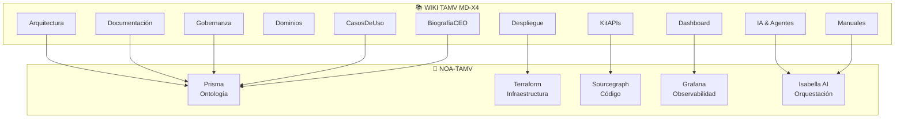
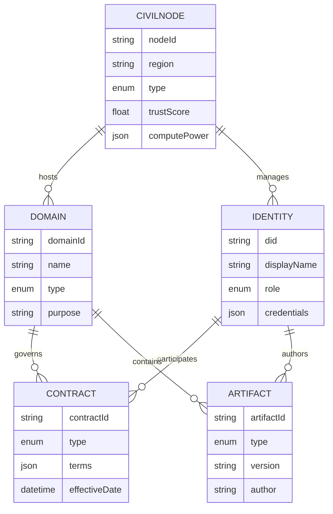
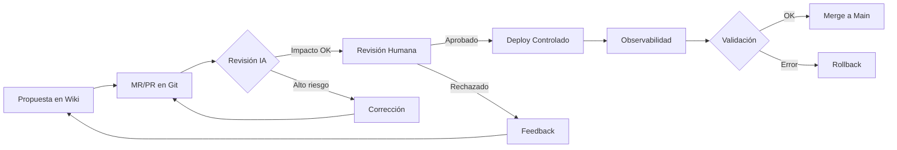

# Manual de Conexión Wiki-Arquitectura NOA-TAMV
## Script Lógico-Funcional para el Núcleo Operativo Autopoiético

**Versión:** 1.0.0  
**Fecha:** 2026-02-28  
**Estado:** Integración Wiki ↔ Arquitectura Técnica  

---

## 0. PLANO 0 – PREMISAS DEL NÚCLEO AUTOPOIÉTICO

### 0.1 Objetivo del Núcleo

El **Núcleo Operativo Autopoiético TAMV (NOA-TAMV)** tiene como misión:

> Mantener y evolucionar el ecosistema civilizatorio TAMV MD‑X4 (dominios, nodos, políticas, código, infra, conocimiento) de forma **autopoiética**, **auditable** y **federada**.

### 0.2 Planos de Operación

| Plano | Tecnología | Wiki TAMV | Función |
|-------|------------|-----------|---------|
| **Data-plane** | Prisma, PostgreSQL, Eventos | `Arquitectura`, `Dashboard` | Estado ontológico del ecosistema |
| **Code-plane** | GitHub, Sourcegraph, CI/CD | `KitAPIs`, `Documentación` | Gestión del conocimiento técnico |
| **Infra-plane** | Terraform, Kubernetes | `Despliegue`, `SistemasAvanzados` | Geometría infraestructural |
| **Observability-plane** | Grafana, Prometheus, Tempo | `Dashboard`, `SistemasAvanzados` | Conciencia fenomenica del sistema |
| **Knowledge-plane** | Wiki TAMV, Neo Wiki, Jupyter | `Documentación`, `Manuales` | Memoria declarativa civilizatoria |

### 0.3 Matriz de Conexión Wiki ↔ Núcleo



---

## 1. PLANO 1 – CARTOGRAFÍA DEL ECOSISTEMA (Ontología y Dominios)

### 1.1 Ontología Prisma - Mapeo Wiki

| Entidad Prisma | Wiki TAMV | Mapeo Lógico |
|----------------|-----------|--------------|
| `CivilNode` | `Arquitectura` → Nodos | Cada nodo federado documentado en Arquitectura se corresponde con una instancia de CivilNode. Atributos: región, guardianía, dominios activos, nivel de certificación. |
| `Identity` | `BiografíaCEO` | Biografía CEO → instancia de Identity con rol "Fundador / Guardián raíz". Llaves: DID, afiliaciones, credenciales. |
| `Domain` | `Dominios` (ID-NVIDA, UTAMV, etc.) | Cada página de Dominio en la wiki → instancia de `Domain` con `Artifact` asociado. |
| `Contract` | `Gobernanza` → Políticas | Términos, obligaciones, dominios afectados, fechas de vigencia. |
| `Artifact` | `CasosDeUso`, `Documentación`, `Manuales` | Todo documento técnico es un Artifact ligado a dominios y nodos. |

### 1.2 Script de Publicación Ontológica

**Acción para la wiki:**

1. En la página **Arquitectura**, agregar sección "Modelo Lógico Prisma TAMV MD‑X4":
   - Diagrama conceptual de entidades (CivilNode, Identity, Domain, Contract, Artifact)
   - Descripción de relaciones
   - Enlace a `prisma/schema.prisma` en el repositorio

2. En cada **Dominio**, agregar metadatos ontológicos:
   ```yaml
   ---
   domain_id: utamv-001
   type: EDUCATION
   node: metropolis-cdmx
   artifacts:
     - docs/utamv/manual.md
     - notebooks/utamv-analytics.ipynb
   ---
   ```

3. En **BiografíaCEO**, vincular identidad:
   - DID del Fundador
   - Credenciales verificables
   - Rol en el sistema: `GuardianSupremo`

### 1.3 Diagrama Ontológico para Wiki



---

## 2. PLANO 2 – INFRAESTRUCTURA Y DESPLIEGUE (Terraform)

### 2.1 Blueprint Terraform - Estructura Wiki

Para cada modo de despliegue en la página **Despliegue**:

| Modo | Wiki Section | Módulo Terraform | Variables Clave |
|------|--------------|------------------|-----------------|
| Cloud | `Despliegue → Cloud` | `tamv_core_infra.cloud` | `cloud_provider`, `region`, `trust_tier` |
| On-Premise | `Despliegue → On-Premise` | `tamv_core_infra.onprem` | `hardware_specs`, `network_fabric` |
| Federada | `Despliegue → Federada` | `tamv_core_infra.federated` | `peer_nodes`, `mesh_topology` |

### 2.2 Módulos Lógicos

Cada módulo contiene:

```hcl
# Estructura conceptual para documentación wiki

tamv_core_infra {
  network_fabric = {
    vpc_cidr      = "10.0.0.0/16"
    subnets       = ["public", "private", "database"]
    mesh_peering  = true
  }
  
  compute_layer = {
    orchestrator  = "kubernetes"
    node_pools    = ["general", "compute", "gpu"]
    auto_scaling  = true
  }
  
  data_layer = {
    primary_db    = "postgresql"
    cache         = "redis"
    storage       = "s3-compatible"
    queues        = "kafka"
  }
  
  observability_stack = {
    metrics       = "prometheus"
    visualization = "grafana"
    tracing       = "tempo"
    logging       = "loki"
  }
}
```

### 2.3 Matriz de Compatibilidad Wiki

**Tabla a incluir en `Despliegue`:**

| Modo | Requisitos Mínimos | Perfil de Riesgo | Dominios Recomendados |
|------|-------------------|------------------|----------------------|
| **Cloud** | 4 vCPU, 16GB RAM, 100GB SSD | Bajo | Todos los dominios |
| **On-Premise** | 8 vCPU, 32GB RAM, 500GB SSD | Medio | ID-NVIDA, UTAMV, Seguridad |
| **Federada** | 2+ nodos Cloud/On-Prem | Bajo (resiliencia) | Todos + redundancia |

---

## 3. PLANO 3 – OBSERVABILIDAD Y DASHBOARD (Grafana + EOCT)

### 3.1 Contrato de Datos Dashboard

En la página **Dashboard**, documentar cada visualización:

#### Métricas Abstractas

| Widget Wiki | Métrica Prisma/Grafana | Significado | Rango Esperado |
|-------------|------------------------|-------------|----------------|
| Barras (Nodos Activos) | `count(civil_node{status="ACTIVE"})` | Nodos federados operativos | > 80% del total |
| Pie (Distribución Dominios) | `count(domain) by (type)` | Balance de dominios | Todos los tipos representados |
| Área (Latencia) | `avg(contract_execution_duration)` | Tiempo de ejecución de contratos | p95 < 500ms |
| Radar (Salud EOCT) | Compuesta: availability, performance, security, governance | Índice de salud global | > 0.85 |

#### Pipeline Lógico Documentar en `SistemasAvanzados → Monitoreo`

```
Servicios → Prometheus (scraping) → Grafana (visualización) 
    ↓
Wiki Dashboard (vistas agregadas/links)
    ↓
Isabella AI (análisis contextual)
```

### 3.2 Mapa EOCT → Métricas

**Sección a agregar en `Dashboard`:**

```yaml
Capas_EOCT:
  Operacional:
    - metric: domain_health_index
    - metric: service_availability
    - metric: user_satisfaction
    
  Coordinación:
    - metric: cross_node_sync_lag
    - metric: load_balance_efficiency
    - metric: scheduling_fairness
    
  Control:
    - metric: policy_violation_rate
    - metric: node_trust_score
    - metric: certificate_validity
    
  Meta-Sistémica:
    - metric: simulation_accuracy
    - metric: auto_remediation_success
    - metric: knowledge_graph_coverage
```

---

## 4. PLANO 4 – CÓDIGO, REPOS Y AUTOPOIESIS

### 4.1 Circuito de Cambio - Script Lógico

Cada endpoint/documento en **KitAPIs** y **Documentación** está respaldado por:

```yaml
artifact_spec:
  source_repository: github.com/OsoPanda1/citemesh-roots
  path: src/pages/KitAPIs.tsx
  
  testing:
    unit: vitest
    integration: supabase-test
    e2e: playwright
    
  observability:
    dashboard: grafana/apis-dashboard
    alerts: api_error_rate > 1%
    
  documentation:
    wiki: /Documentacion
    openapi: /contracts/openapi.yaml
```

### 4.2 Flujo de Cambio en Gobernanza

**Sección a agregar en `Gobernanza`:**



### 4.3 Rol de Isabella en el Loop

En **IA & Agentes**, definir:

| Función | Isabella Capability | Interfaz Wiki |
|---------|-------------------|---------------|
| **Lectura** | Explicar consecuencias de cambios | Chat en cada página |
| **Búsqueda** | Localizar artefactos, políticas, casos | `/buscar` global |
| **Asistencia** | Sugerir especificaciones o tests | Sugerencias contextuales |
| **Validación** | Analizar impacto de propuestas | Reportes pre-deploy |

---

## 5. PLANO 5 – SOCIAL CORE Y GOBERNANZA CIVILIZATORIA

### 5.1 Social Core como Capa de Relaciones

En **Dominios → Seguridad** y **SistemasAvanzados**, describir:

```yaml
social_core:
  description: "Capa de relaciones entre Identity, CivilNode y Domain"
  
  components:
    reputation:
      - metric: trust_score
      - metric: contribution_history
      - metric: peer_reviews
      
    delegation:
      - authority_transfer
      - proxy_voting
      - role_inheritance
      
    participation:
      - proposal_creation
      - voting_rights
      - audit_access
```

### 5.2 Roles y Procesos en Gobernanza

**Matriz a incluir en `Gobernanza`:**

| Rol | Propón | Veta | Aprueba | Audita |
|-----|--------|------|---------|--------|
| **Guardian Supremo** | ✓ | ✓ | ✓ | ✓ |
| **Guardianía de Dominio** | ✓ | ✗ | ✓ | ✓ |
| **Operador Certificado** | ✓ | ✗ | ✗ | ✗ |
| **Auditor** | ✗ | ✗ | ✗ | ✓ |
| **Ciudadano** | ✓ | ✗ | ✗ | ✗ |

### 5.3 Rutas Funcionales por Rol

**Sección a crear en `Manuales → Por Rol`:**

#### Soy Guardian de Dominio
```
Home → Dashboard (mi dominio)
    → Sistemas Avanzados (configuración)
    → Documentación (políticas)
    → IA & Agentes (consultas Isabella)
    → Gobernanza (propuestas)
```

#### Soy Auditor
```
Home → Biografía (contexto fundacional)
    → Gobernanza (reglas)
    → Dashboard (métricas)
    → Documentación (evidencia)
    → Despliegue (configuración)
```

---

## 6. PLANO 6 – MANUAL DE OPERACIÓN DIARIA

### 6.1 Ciclo Diario del Núcleo TAMV

**Documentar en `Manuales → Plan de Operación`:**

#### Check de Apertura (09:00)
- [ ] Revisar `Dashboard` → Salud general de nodos y dominios
- [ ] Revisar `SistemasAvanzados` → Alertas EOCT por capa
- [ ] Consultar Isabella: "¿Hay riesgos críticos hoy?"

#### Monitoreo Continuo (09:00-18:00)
- Guardianes de dominio monitorean sus secciones específicas
- Isabella responde consultas contextuales:
  - "¿Por qué el dominio UTAMV tiene latencia alta?"
  - "¿Qué políticas aplican a este caso?"
  - "¿Dónde está documentado X?"

#### Gestión de Cambios (Según necesidad)
1. **Origen de cambio:**
   - Observación en `Dashboard`
   - Recomendación de Isabella
   - Nuevo `CasoDeUso`
   
2. **Flujo:**
   - Documentar propuesta en Wiki
   - Crear MR/PR
   - Revisión IA + Humana
   - Deploy controlado
   - Observar en `Dashboard`

#### Cierre de Día (18:00)
- [ ] Registrar hitos en `LíneaDeTiempo`
- [ ] Actualizar `CasosDeUso` si aplica
- [ ] Ajustar `Estrategia` si hay cambios significativos

### 6.2 Ciclo de Incorporación de Nodo Nuevo

**Checklist en `Manuales → Onboarding de Nodo`:**

| Paso | Wiki | Acción | Responsable |
|------|------|--------|-------------|
| 1 | `Despliegue → Federada` | Consultar blueprint | Nuevo operador |
| 2 | `Arquitectura` | Registrar CivilNode | Guardian Supremo |
| 3 | `Dominios` | Definir dominios operados | Guardianía |
| 4 | `Gobernanza` | Asignar guardianía | Guardian Supremo |
| 5 | `Dashboard` | Integrar observabilidad | Operador |
| 6 | `SistemasAvanzados` | Validar conectividad | Equipo Técnico |

---

## 7. INTEGRACIÓN COMPLETA: Wiki como Front del NOA-TAMV

### 7.1 Arquitectura de Navegación Funcional

```
┌─────────────────────────────────────────────────────────────┐
│                    WIKI TAMV MD-X4                          │
│                   (Front del NOA-TAMV)                      │
├─────────────────────────────────────────────────────────────┤
│  Navegación Principal                                       │
│  ├── 🏛️ Arquitectura → Ontología Prisma + EOCT             │
│  ├── 📊 Dashboard → Grafana Embed + Métricas               │
│  ├── 🚀 Despliegue → Terraform Blueprints                  │
│  ├── 🌐 Dominios → Instancias de Domain                    │
│  ├── 👤 BiografíaCEO → Identity Fundador                   │
│  ├── 📚 Documentación → Artifacts                          │
│  ├── ⚙️ KitAPIs → Sourcegraph + OpenAPI                    │
│  ├── 🤖 IA & Agentes → Isabella Interface                  │
│  ├── 📖 Manuales → Runbooks Operativos                     │
│  ├── 🎯 CasosDeUso → Requisitos → Artifacts                │
│  ├── 📅 LíneaDeTiempo → Historial Civilizatorio            │
│  └── 📋 Gobernanza → Contracts + Roles                     │
├─────────────────────────────────────────────────────────────┤
│  Backend (NOA-TAMV)                                         │
│  ├── Prisma (Data-plane)                                   │
│  ├── Terraform (Infra-plane)                               │
│  ├── Grafana (Observability-plane)                         │
│  ├── Sourcegraph (Code-plane)                              │
│  └── Isabella AI (Knowledge-plane)                         │
└─────────────────────────────────────────────────────────────┘
```

### 7.2 Checklist de Conexión Completa

- [ ] **Plano 0:** Premisas documentadas en `Introduccion`
- [ ] **Plano 1:** Ontología publicada en `Arquitectura`
- [ ] **Plano 2:** Blueprints en `Despliegue`
- [ ] **Plano 3:** Contrato de datos en `Dashboard`
- [ ] **Plano 4:** Circuito de cambio en `Gobernanza`
- [ ] **Plano 5:** Social Core en `Seguridad` + `Gobernanza`
- [ ] **Plano 6:** Manuales operativos en `Manuales`

### 7.3 Próximos Pasos de Implementación

1. **Fase 1:** Crear/actualizar páginas wiki según este manual
2. **Fase 2:** Implementar Prisma schema en base de datos
3. **Fase 3:** Configurar dashboards Grafana
4. **Fase 4:** Integrar Isabella con búsqueda semántica
5. **Fase 5:** Implementar circuitos de autopoiesis

---

## Referencias Cruzadas

| Documento | Ubicación | Propósito |
|-----------|-----------|-----------|
| Arquitectura Técnica Completa | `docs/architecture/TAMV-Core-Architecture.md` | Especificación técnica del NOA-TAMV |
| Schema Prisma | `prisma/schema.prisma` | Ontología ejecutable |
| Este Manual | `docs/architecture/TAMV-Wiki-Integration-Manual.md` | Puente Wiki ↔ Arquitectura |

---

*"La wiki es el rostro civilizatorio; el núcleo es su corazón autopoiético."*